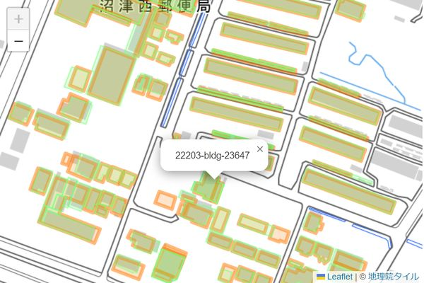
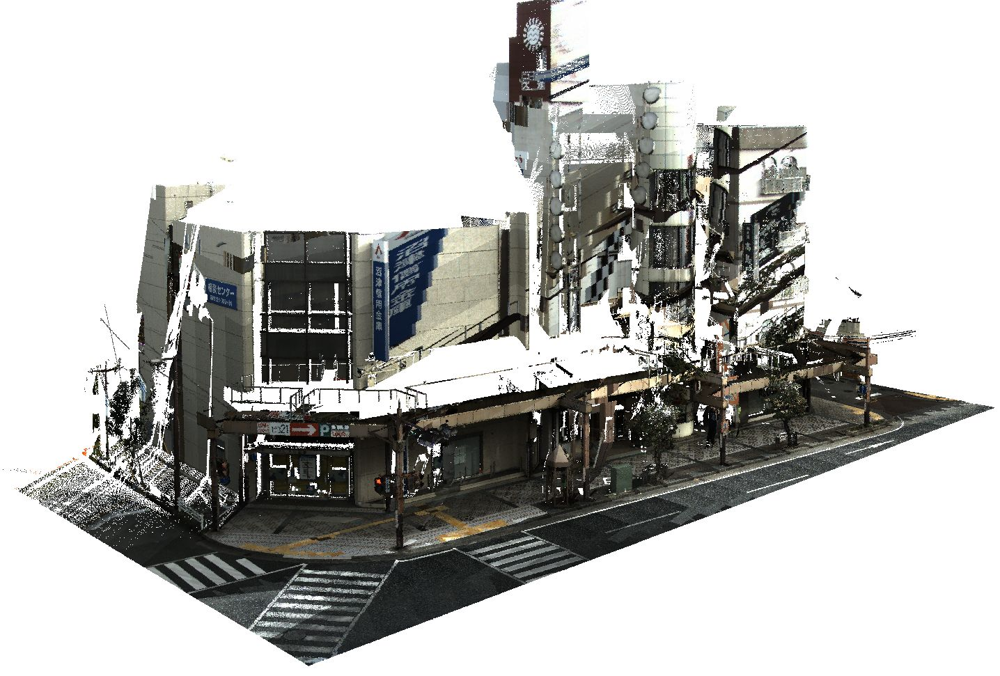
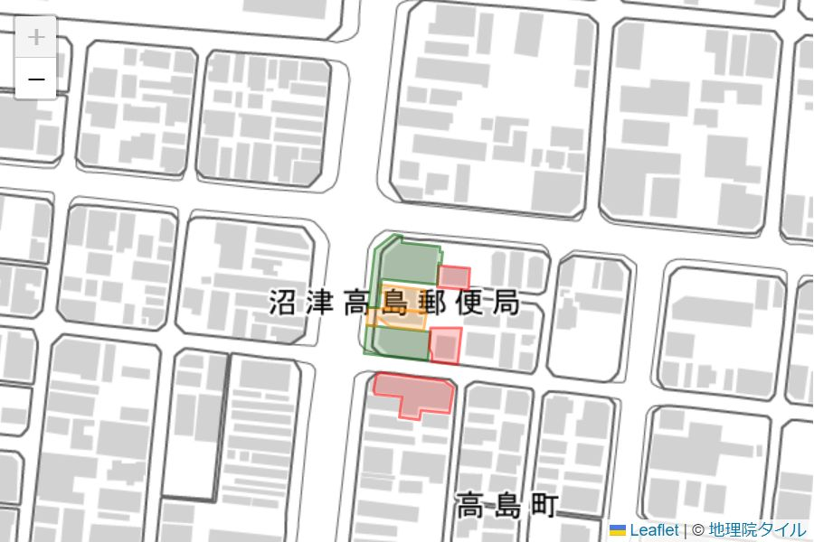
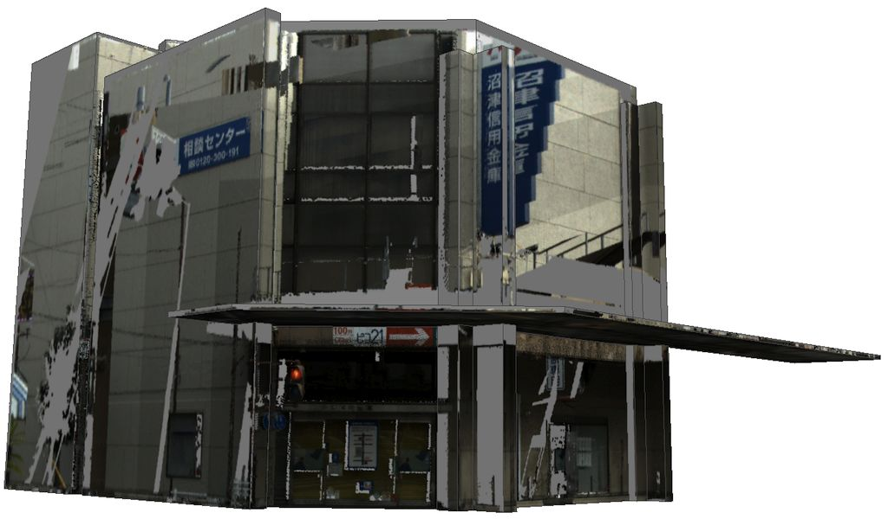

# FY2022 Project PLATEAU UC22-008「3D都市モデルを基礎としたIDマッチング基盤」の成果物（Building matching WebAPI）

## 1. 概要
本ソフトウェアは、2D 地図データおよび 3D 点群データを 3D都市モデルの建物データと突合し、建物 ID との関連付けを行うWebAPI 機能を提供するサービスアプリケーションです。

以下の機能を提供します。

- [2D 建物マッチング機能](#2d): 2D 建物ポリゴンを 3D都市モデルの建物データにマッチングします。
- [3D 点群マッチング機能](#3d_pointcloud): 3D 点群データを 3D都市モデルの建物データにマッチングします。
- [3D テクスチャマッピング機能](#3d_texture): 3D 点群データを 3D都市モデルの建物データのテクスチャとして
  マッピングします。

## 2．「3D都市モデルを基礎としたIDマッチング基盤」について
### ユースケースの概要
近年、地理空間情報の活用が活発になる一方、建物や土地に関する様々な情報が別個に存在し、統合が進んでいないため、総合的、複合的なデータ分析の課題となっています。
今回の実証実験では、3D都市モデルの幾何形状を基礎データとして多様な地理空間情報をマッチング処理し、建物IDを介したデータ結合を行う基盤を構築することで、様々な地理空間情報の統合を促進します。

### 開発システムの概要
#### <a name="2d">2D 建物マッチング機能</a>

- 機能概要

    [GeoJSON](https://geojson.org/) ポリゴンで表現された 2D 建物データを問い合わせとして送信すると、
    対応する 3D都市モデルの建物データを GeoJSON 形式で返します。

    次の画像は WebAPI デモアプリケーションでの実行例です。

    

    検索したい建物群（リクエスト）がオレンジ色、それに一致すると判断された
    3D都市モデルの建物データ群（レスポンス）が緑色で表示しています。
    レスポンスの個々の建物には、リクエストの建物が持つ属性情報が渡されます。

- API 詳細

    [WebAPI「2D 建物マッチング機能」](https://project-plateau.github.io/PLATEAU-UC22-008-Building-matching-WebAPI/manual/10_webapi.html#2d) を参照してください。

#### <a name="3d_pointcloud">3D 点群マッチング機能</a>

- 機能概要

    [LAS フォーマット](https://www.ogc.org/standards/LAS) の 3D 
    点群データファイルを問い合わせデータとして送信すると、その点群に
    対応する 3D都市モデルの建物データのリストと、点群がそれぞれの建物表面を
    カバーする面積を 2D GeoJSON 形式で返します。

    次の画像は WebAPI デモアプリケーションでの実行例です。

    
    

    1枚目画像の点群データをリクエストとして送ると、この点群に含まれていると
    判断された 3D都市モデルの建物データ群が2枚目画像に示したポリゴンとして返されます。
    レスポンスの個々の建物には、建物表面付近に点群データが存在する面積と
    建物のモデルから計算した表面積が属性情報として渡されます。

    図で緑色に表示されている建物は表面の40%以上に点群データが存在しているもの、
    オレンジ色は 20% 以上、赤色は 20% 未満を表しています。

- API 詳細

    [WebAPI「3D 点群マッチング機能」](https://project-plateau.github.io/PLATEAU-UC22-008-Building-matching-WebAPI/manual/10_webapi.html#3d_pointcloud) を参照してください。

#### <a name="3d_texture">3D テクスチャマッピング機能</a>

- 機能概要

    3D 点群データと 3D都市モデルの建物データの ID を問い合わせデータとして送信すると、
    その建物に点群データから生成したテクスチャをマッピングした
    3D都市モデルデータを [Wavefront OBJ 形式](https://en.wikipedia.org/wiki/Wavefront_.obj_file) のファイルとして返します。

    次の画像は WebAPI デモアプリケーションでの実行例です。

    
    

    1枚目画像の点群データと 3D都市モデルの建物データの ID をリクエストとして送ると、
    この点群データから建物表面付近の点を選択して、それぞれの壁面の
    テクスチャ画像を作成します。

    実際に返されるのは Zip 形式のファイルで、中には 3D都市モデルの建物データのモデルから作成した
    OBJ ファイル、面と画像の関係を管理する MTL ファイル、
    および面ごとのテクスチャ画像ファイル（PNG）が含まれます。

- API 詳細

    [WebAPI「3D テクスチャマッピング機能」](https://project-plateau.github.io/PLATEAU-UC22-008-Building-matching-WebAPI/manual/10_webapi.html#3d_texture) を参照してください。

## 3．利用手順
インストール方法・使い方は[こちら](https://project-plateau.github.io/PLATEAU-UC22-008-Building-matching-WebAPI/)

## ライセンス <!-- 定型文のため変更しない -->
* ソースコードおよび関連ドキュメントの著作権は国土交通省に帰属します。
* 本ドキュメントは[Project PLATEAUのサイトポリシー](https://www.mlit.go.jp/plateau/site-policy/)（CCBY4.0および政府標準利用規約2.0）に従い提供されています。

## 注意事項 <!-- 定型文のため変更しない -->

* 本レポジトリは参考資料として提供しているものです。動作保証は行っておりません。
* 予告なく変更・削除する可能性があります。
* 本レポジトリの利用により生じた損失及び損害等について、国土交通省はいかなる責任も負わないものとします。

## 参考資料　 <!-- 各リンクは納品時に更新 -->
* 3D都市モデルを基礎としたIDマッチング基盤技術検証レポート: https://www.mlit.go.jp/plateau/libraries/technical-reports/
* PLATEAU Webサイト Use caseページ「3D都市モデルを基礎としたIDマッチング基盤」: https://www.mlit.go.jp/plateau/use-case/uc22-008/

主なライブラリ
* GDAL : https://pypi.org/project/GeoAlchemy2/
* GeoAlchemy2 : https://pypi.org/project/GeoAlchemy2/
* GeoPandas : https://geopandas.org/en/stable/
* laspy : https://laspy.readthedocs.io/en/latest/index.html
* Leaflet : https://leafletjs.com/
* NumPy : https://numpy.org/
* Open3D : http://www.open3d.org/
* Pillow : https://pillow.readthedocs.io/en/stable/
* PostGIS : https://postgis.net/
* PostgreSQL : https://www.postgresql.org/
* SciPy : https://scipy.org/
* Shapely : https://pypi.org/project/shapely/
