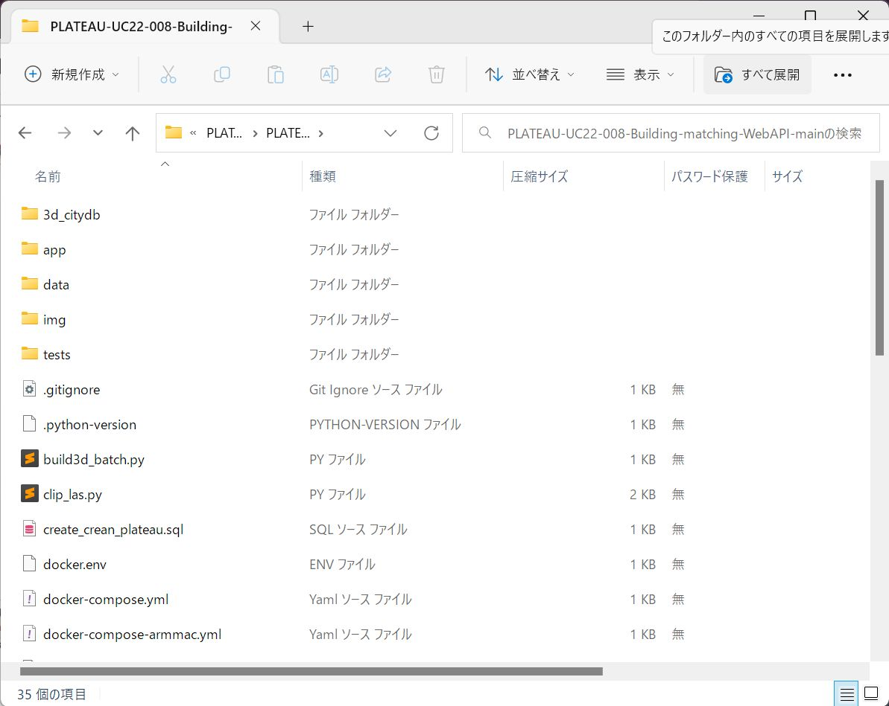
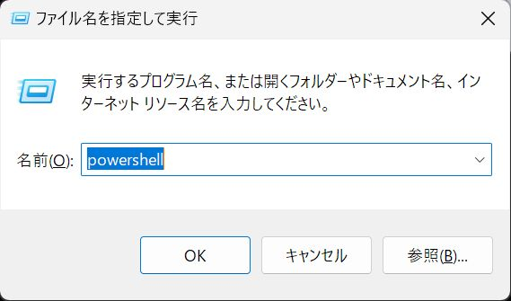
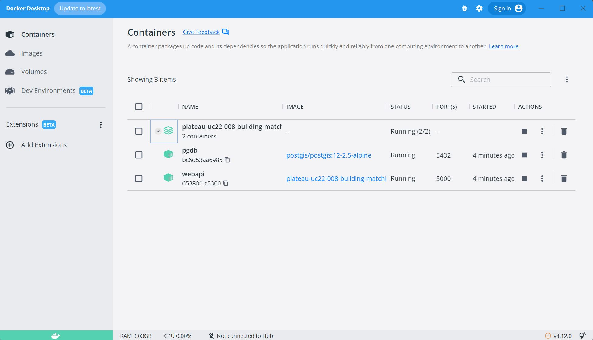
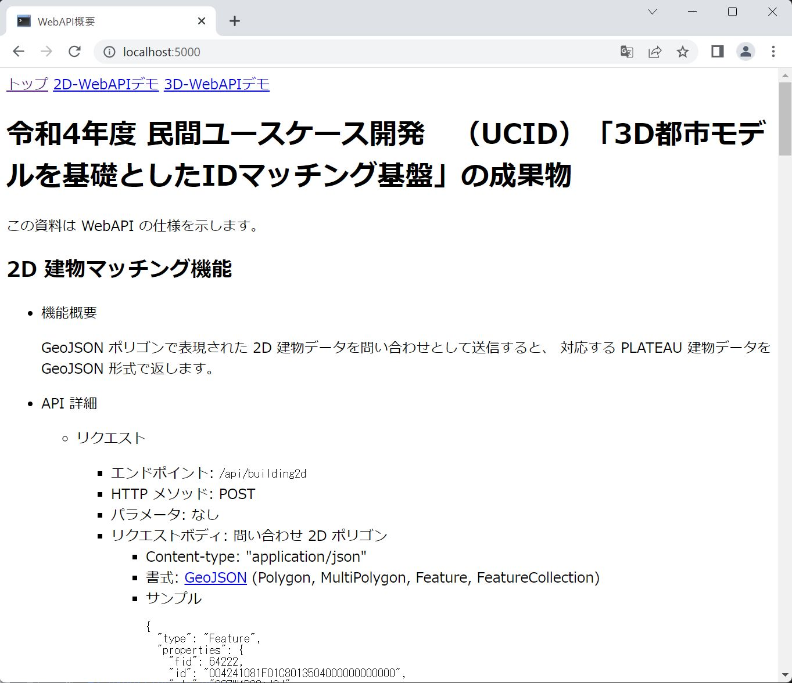

このページでは、建物IDマッチング WebAPI の設定手順を説明します。

- [Docker Desktop をインストール](#install_docker)
- [コードを取得](#download)
- [Zip ファイルを展開](#extract)
- [PowerShell を開く](#shell)
- [イメージのビルド](#build)
- [ウェブサーバ実行](#start_server)
- [デモアプリケーションを開く](#open_app)
- [停止・アンインストール手順](#uninstall)

本ソフトウェアは、Linux システム上で動作するサーバアプリケーションとして開発されています。運用目的でのインストールや実行には Linux およびウェブサーバの管理スキルが必要ですが、開発や動作確認用ならば Windows や Mac 上の Docker Desktop で動かすこともできます。運用目的で Linux サーバ上に本ソフトウェアをインストールする手順は本ドキュメントの対象外のため、[プロジェクトリポジトリ](https://github.com/InfoProto/PLATEAU-UC22-008-Building-matching-WebAPI/) の INSTALL.md を参照してください。

Windows および MacOS 用の Docker Desktop および Ubuntu 用の Docker Engine で動作を確認していますが、このページでは例として Windows PowerShell + Docker Desktop での手順を説明します。

Docker Desktop をまだインストールしていない場合は、
先に 

## <a name="install_docker">Docker Desktop をインストール</a>

まず [Docker Desktop の公式サイト](https://docs.docker.com/desktop/)からダウンロード、インストールしてください。既にインストール済みの場合は、念のため最新バージョンにアップデートしてください。

[Windows へのインストール手順](https://docs.docker.com/desktop/install/windows-install/) は以下の通りです (2023年2月22日時点)。

- 管理者権限を持つアカウントでログイン。
- [Docker Desktop for Windows をダウンロード](https://desktop.docker.com/win/main/amd64/Docker%20Desktop%20Installer.exe)。
- ダウンロードした `Docker Desktop Installer.exe` をダブルクリックして実行。
- もし確認ウィンドウが表示されたら、 "Use WSL 2 instead of Hyper-V" オプションを選択（システムによっては表示されないこともあります）。
- あとは画面表示に従ってインストール。

インストールが完了したら、スタートボタンから **Docker Desktop** を見つけて実行してください。

## <a name="download">コードを取得</a>

ソフトウェア一式を GitHub サイトからダウンロードします。

ウェブブラウザで [https://github.com/InfoProto/PLATEAU-UC22-008-Building-matching-WebAPI/archive/refs/heads/main.zip](https://github.com/InfoProto/PLATEAU-UC22-008-Building-matching-WebAPI/archive/refs/heads/main.zip) にアクセスし、ダウンロードした ``PLATEAU-UC22-008-Building-matching.WebAPI-main.zip`` を任意のディレクトリに置いてください。

## <a name="extract">Zip ファイルを展開</a>

エクスプローラーで Zip ファイルをダブルクリックして開き、「すべて展開」ボタンを押して含まれているファイルを展開します。

## <a name="shell">PowerShell を開く</a>

Win + R キーを押し、「ファイル名を指定して実行」ダイアログが開いたら `powershell` と入力して OK ボタンを押します。

PowerShell のプロンプトに `chdir` と入力し、先ほど Zip ファイルを展開したフォルダ名を入力します。

> ヒント：PowerShell のウィンドウにエクスプローラーからフォルダをドラッグ＆ドロップしても入力できます。

Enter キーを押してフォルダを移動します。

## <a name="build">イメージのビルド</a>

PowerShell のプロンプトに以下のコマンドを入力し、 Docker で実行するイメージを作成します。

    > docker compose build

この処理にはしばらく時間がかかります。実行中の処理が表示されますので、終了するまで待ってください。 `Use 'docker scan' to run Snyk tests...` と表示され、プロンプトが表示されれば成功です。

> Apple シリコン搭載の Mac を利用する場合、一部のライブラリをコンパイルしなおす必要があるため、docker compose の後に `-f dockercompose-armmac.yml` を指定してください。。

    > docker compose -f dockercompose-armmac.yml build

## <a name="start_server">ウェブサーバ実行</a>

PowerShell のプロンプトに以下のコマンドを入力し、 Docker 上でウェブサーバを起動します。

    > docker compose up -d

次のように表示されるはずです（時間は環境によって異なります）。

    [+] Running 4/4
     - Network plateau-uc22-008-building-matching-webapi-main_default     Created                                      0.0s
     - Volume "plateau-uc22-008-building-matching-webapi-main_pgdb_data"  Created                                      0.0s
     - Container pgdb                                                     Started                                      2.6s
     - Container webapi                                                   Started                                      2.6s

Docker Desktop のウィンドウでは、 Containers のページで 2 つのコンテナが実行中であることを確認できます。

`pgdb` はデータベース管理システム [PostgreSQL](https://www.postgresql.org/) サーバで、PLATEAU データの検索機能を提供します。
`webapi` は WebAPI 機能を提供するウェブサーバです。

## <a name="open_app">デモアプリケーションを開く</a>

ウェブサーバが起動したら、ウェブブラウザで [ローカルホストの port 5000](http://localhost:5000/) を開いてください。

上部の「2D-WebAPIデモ」および「3D-WebAPIデモ」から WebAPI の機能を試す画面に移動することができます。

以上でインストール完了です。

## <a name="uninstall">停止・アンインストール手順</a>

起動したコンテナを停止するには、 Zip ファイルを展開したフォルダで次のコマンドを実行します。

    > docker compose down -v

Docker Desktop ウィンドウの Containers 画面で `pgdb` と `webapi` が消えていることを確認してください。

その後、 Docker Desktop ウィンドウの Images 画面で `plateau-uc22-008-building-matching-webapi-webapi` と `postgis/postgis` を削除します。

Volumes 画面で `plateau-uc22-008-building-matching-webapi_pgdb_data` が残っている場合はこれも削除します。

あとは Zip ファイルを展開したフォルダごと削除してください。

以上でアンインストール完了です。