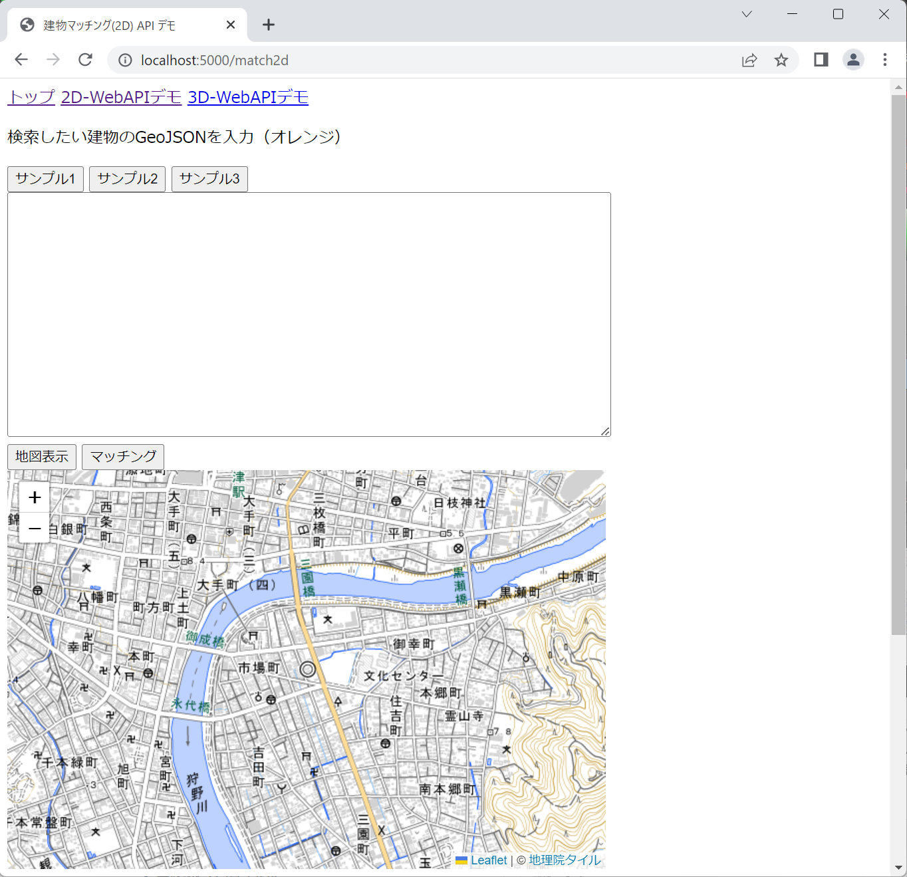
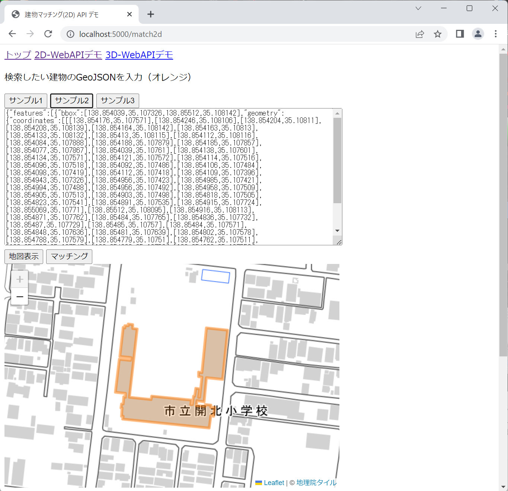
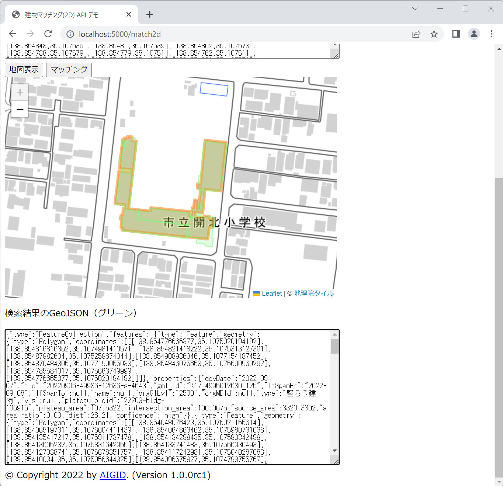
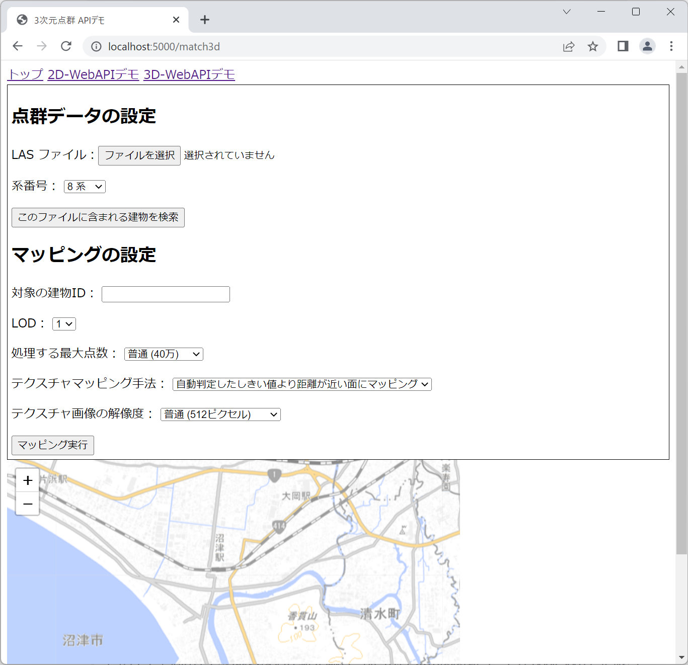
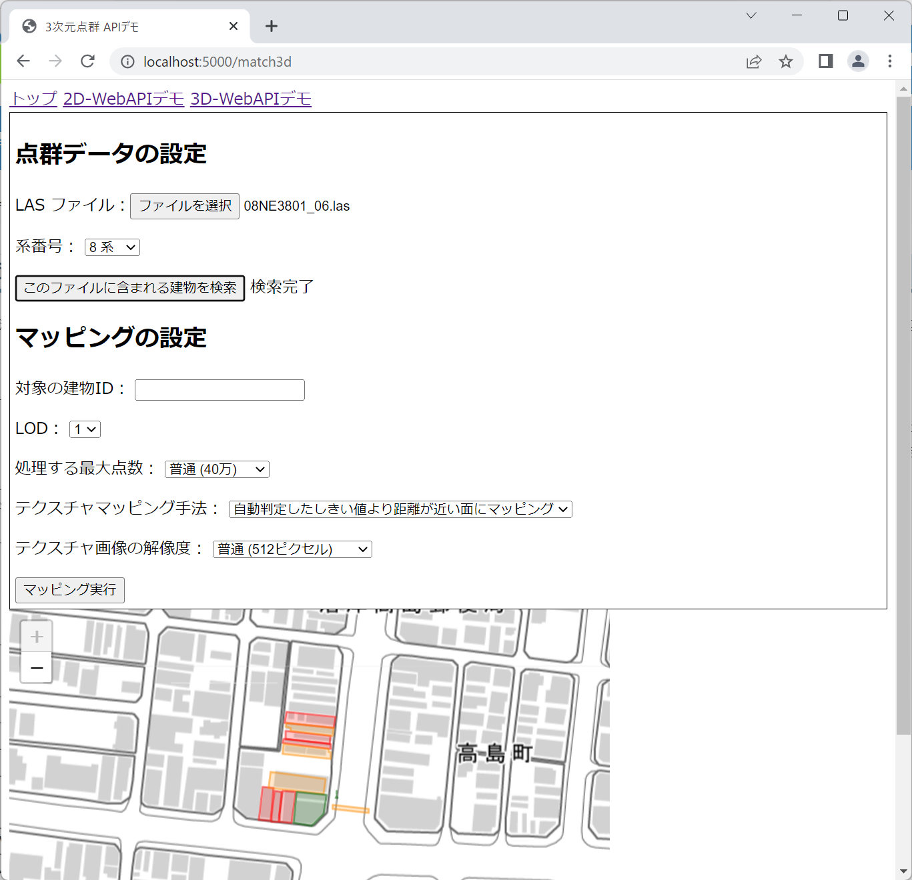
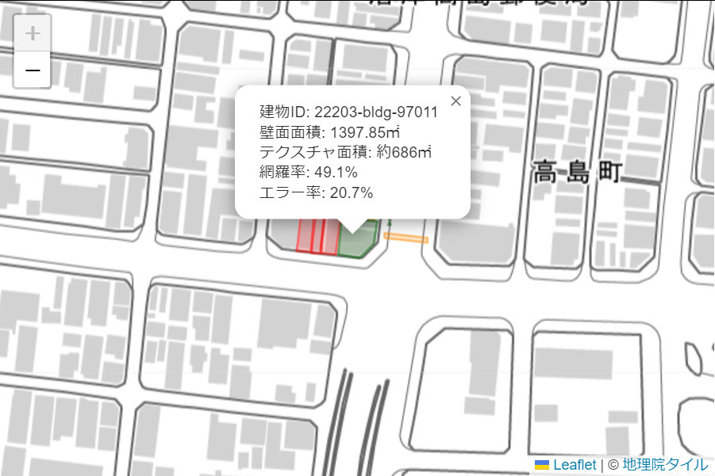
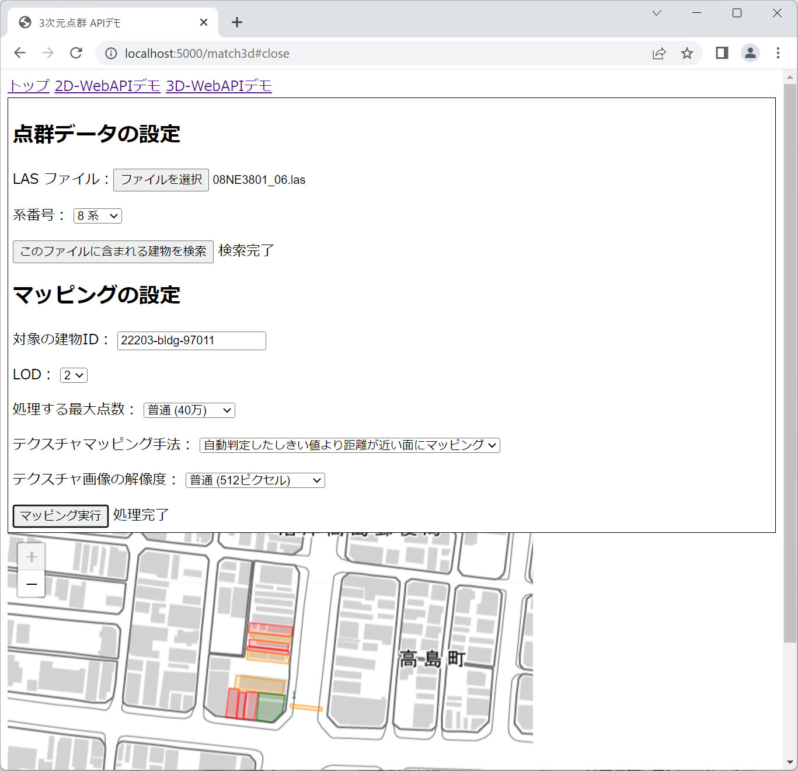
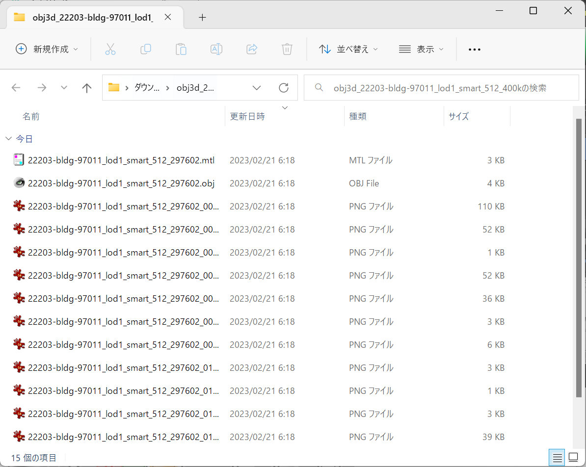
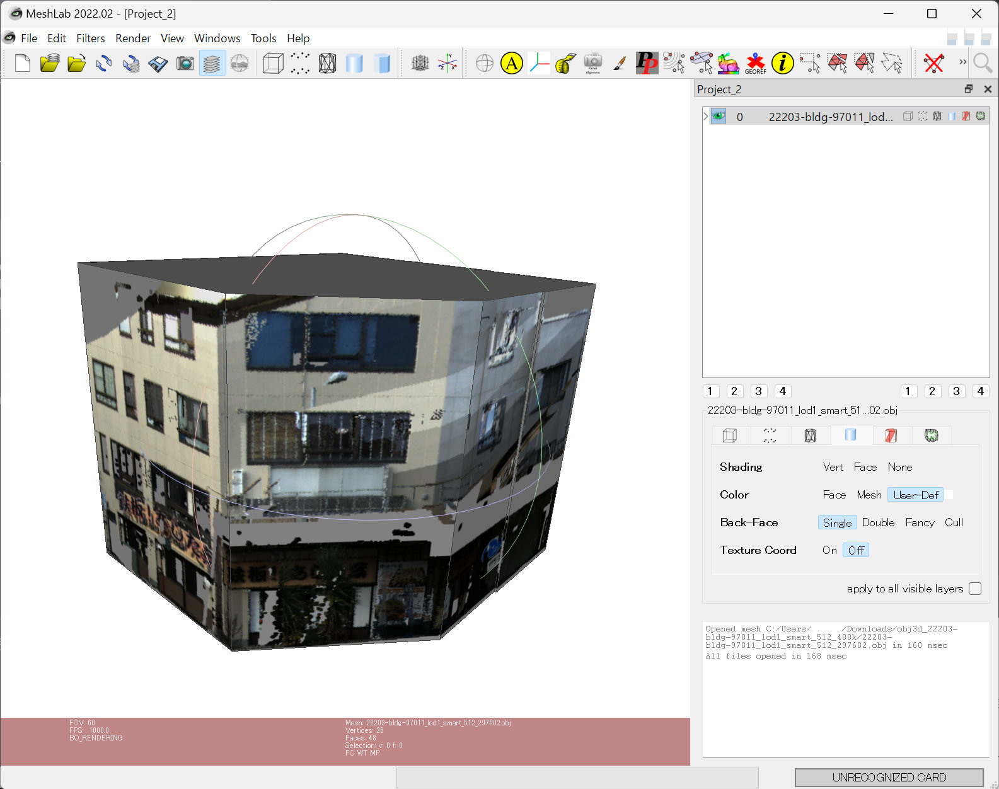
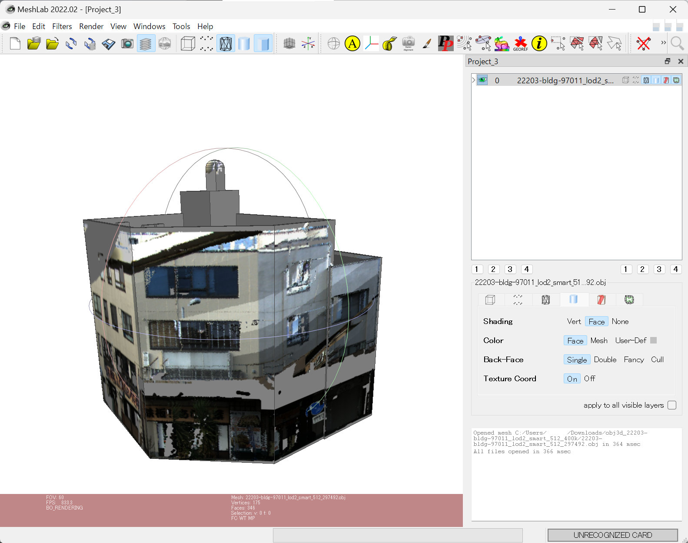

このページでは、建物IDマッチング WebAPI のテスト用デモアプリケーションの利用方法を説明します。

先に [インストール手順](install) に従ってデモアプリケーションのウェブサーバを実行してください。

- [2D-WebAPIデモ](#2D_demo)
- [3D-WebAPIデモ](#3D_demo)

## <a name="2D_demo">2D-WebAPI デモ</a>

ページ上部の「2D-WebAPIデモ」リンクをクリックすると、2D 建物マッチング機能のデモ画面が開きます。

> このデモで利用できる地域は「沼津市全域」です。それ以外の地域はサンプルデータベースに登録されていないため、検索できません。

- GeoJSON のセットと地図表示

    「サンプル1」「サンプル2」「サンプル3」というボタンを押すと、上部のテキストエリアにサンプルデータの GeoJSON が上部のテキストエリアに、その下に GeoJSON をオレンジ色で描画した地図が表示されます。

    > サンプルにない GeoJSON を試したい場合は、テキストエリアに GeoJSON を貼りつけ、「地図表示」ボタンを押してください。

    

- マッチング実行

    テキストエリアの下の「マッチング」ボタンを押すと、「2D 建物マッチング機能」WebAPI に GeoJSON を送信し、その建物と一致する PLATEAU 建物を取得します。

    WebAPI のレスポンスも GeoJSON （FeatureCollection）データです。地図上に緑色で描画し、ページ下部のテキストエリアに GeoJSON 文字列をそのまま表示します。

    

    レスポンスの各フィーチャーの properties には、検索した GeoJSON の properties に含まれる `devDate`, `fid` ... `type` などの属性がそのまま含まれていることが確認できます。

    また、元の建物データには無かった以下の属性が追加されます。

    - `plateau_bldid`: 一致したPLATEAU建物ID
    - `plateau_area`: 一致したPLATEAU建物の面積
    - `intersection_area`: 検索した建物とPLATEAU建物の重なり合った部分の面積
    - `source_area`: 検索した建物の面積
    - `area_ratio`: 検索した建物の面積のPLATEAU建物の面積に対する比率
    - `dist`: それぞれの重心間の距離
    - `confidence`: マッチング確信度（high または low）

    面積の単位は平方メートル、距離の単位はメートルです。

- 各サンプルの説明

    「サンプル1」はもっとも単純なケースで、検索した1つの建物が1つの PLATEAU 建物にマッチする例です。少しだけ形状が異なりますが、ほぼ重なっているため同じ建物と判定されます。

    「サンプル2」は少し複雑なケースで、検索した建物（小学校）に対する PLATEAU 建物が複数に分割されている例です。レスポンスを確認すると5つのフィーチャーから構成されていることが分かります。

    「サンプル3」は複数の建物を問い合わせるケースです。レスポンスの各 PLATEAU 建物には、検索した建物の中でもっとも一致すると判定されたものの属性が付与されます。検索した建物に識別子となる属性が含まれていれば、どの PLATEAU 建物と対応したか判定できます。

## <a name="3D_demo">3D-WebAPI デモ</a>

ページ上部の「3D-WebAPIデモ」リンクをクリックすると、3D 点群マッチング機能と3Dテクスチャマッピング機能のデモ画面が開きます。

> このデモで利用できる地域は沼津駅北側の一部（国土基本図図郭コードが 08NE3801）に限られます。それ以外の地域はサンプルデータベースに登録されていないため、検索できません。

3D WebAPI では、問い合わせに LAS データが必要です。テクスチャマッピングに適した MMS データは [MMSデータ ダウンロードページ（G空間情報センター）](https://www.geospatial.jp/ckan/dataset/shizuoka-2019-pointcloud/resource/7b986b95-c5a0-4a14-823c-129de28ee2a8?view_id=29dd1ab9-7f70-45ab-90ed-6e194c2d2ac9) からダウンロード可能ですが、そのままではファイルが大きすぎるため、
サンプルデータベースに含まれる地域の LAS データから数棟の建物が含まれる程度に切り出したサンプルデータ（約746MB）を用意してあります。[こちらからダウンロード](https://digitalcityservice-building-matching.s3.ap-northeast-1.amazonaws.com/22/222038/08NE3801_LAS.zip)してください。

### <a name="3D_matching">3D 点群マッチング機能</a>

「3D 点群マッチング機能」は、 LAS ファイルに含まれている PLATEAU 建物を検索し、点群データとどの程度一致しているかを評価する機能です。

- 点群データに含まれる建物を検索

    「ファイルを選択」ボタン（ブラウザによって表記が違います）を押して、アップロードする LAS ファイルを指定してください。

    「系番号」には「8系」を選択してください。これは[平面直角座標系](https://www.gsi.go.jp/LAW/heimencho.html)の系番号を指定するもので、このデモアプリに登録されている沼津市はVIII系の適用区域に含まれます。

    設定したら「このファイルに含まれる建物を検索」ボタンを押してください。「検索中です。しばらくお待ちください。」と表示されます。この処理には LAS ファイルのサイズやマシンスペックにもよりますが10秒から30秒程度かかります。

    処理が終わると表示が「検索完了」に変わり、ページ下部の地図上に建物が描画されます。下の図はサンプルデータの `08NE3801_06.las` をアップロードして検索した結果です。

    

- 検索結果

    緑色の建物は建物表面全体の 40% 以上の範囲が点群データに含まれていたことを示します。道路から見て裏側は点群データがないことを考慮すると、道路から見える表面の大部分に点群データがあることになります。オレンジ色は 20% 以上、赤色は 20% 未満を表します。

    地図上の建物をクリックすると、より詳しい情報がポップアップします。各項目の意味は次の通りです。

    - 建物ID: PLATEAU 建物ID
    - 壁面面積: LoD2 モデルから算出した、この建物の壁面面積
    - テクスチャ面積: アップロードされた点群データから作成可能なテクスチャの面積
    - 網羅率: 壁面面積に対するテクスチャ面積の割合
    - エラー率: 建物の領域内にある点データのうち、壁面付近にない点の割合

    

### <a name="3D_texture">3D テクスチャマッピング機能</a>

「3D テクスチャマッピング機能」は、 LAS ファイルに含まれている点群データを指定した建物に射影し、壁面のテクスチャ画像を含む 3D モデルを生成する機能です。

- テクスチャマッピング（3D テクスチャマッピング機能）

    マッチングに利用した点群データを引き続き利用して建物の壁面画像を作成し、テクスチャマッピングした3Dモデルを作成します。「マッピングの設定」の下の各項目に次のように指定してください。

    「対象の建物ID」に PLATEAU 建物IDを入力します。検索結果の建物ポリゴンをクリックすればその建物の ID が入力されますので、緑色の建物（22203-bldg-97011）をクリックしてください。

    「LOD」には作成したいモデルの LOD を指定します。1の方が単純な形状なので処理は速く終わりますが、2の方がよりリアルなモデルが得られます。まずは1を指定してください。

    「処理する最大点数」は、点群データを建物の領域で切り出したときに点の数が多すぎると処理に時間がかかるため、上限を設定するものです。ここで指定した値より多くの点が含まれていた場合、ダウンサンプリング処理を行って点の数を減らします。その分処理は速くなりますが、画像は粗くなります。ここではデフォルトの「普通（40万）」のままにします。

    「テクスチャマッピング手法」は点を面にマッピングする計算方法を選択します。ここもデフォルトの「自動判定したしきい値より距離が近い面にマッピング」のままにします。

    「テクスチャ画像の解像度」は壁面ごとの画像の長辺の画素数を指定します。通常は「普通（512ピクセル）」で問題ないですが、小さな建物の場合は「粗い（256ピクセル）」でも十分ですし、駅ビルのような大きな建物の場合は「細かい（1024ピクセル）」の方がきれいな結果が得られます。ここもデフォルトの「普通（512ピクセル）」のままにします。

    設定が終わったら「マッピング実行」ボタンを押してください。「処理中です。しばらくお待ちください。」と表示されます。設定した最大点数やLODにもよりますが、この処理には30秒から数分間かかることがあります。

    処理が終わると「処理完了」と表示が変わり、自動的に zip ファイルのダウンロードが始まります。

    

- マッピング結果

    ダウンロードされるファイルは `obj3d_22203-bldg-97011_lod1_smart_512_400k.zip` のような名前の zip ファイルです。 obj3d は共通の接頭辞で、そのあとに PLATEAU 建物ID (22203-bldg-97011) 、選択したLOD (lod1)、マッピング手法 (smart)、画像解像度 (512)、最大点数 (400k) が続きます。

    この zip ファイルを展開すると、1つの obj ファイル、1つのmtlファイル、最大で壁面数分の PNG ファイル、テクスチャがない壁面用の no_texture.png ファイルが含まれています。

    

- モデルの可視化

    ダウンロードした 3D モデルを可視化するには 3D ビューアが必要です。オープンソースの 3D ビューア [MeshLab](https://www.meshlab.net/) が便利です。

    MeshLab を起動し、メニューの File > Import Mesh を選択します。ダイアログが表示されるので、ダウンロードした zip ファイルを展開してから obj ファイルを選択してください。

    

    同じ建物を LOD=2 でマッピングすると、よりリアルなモデルが得られます。

    

デモアプリケーションの機能は以上です。
