このページでは、建物IDマッチング WebAPI で利用するデータの作り方について説明します。

## <a name="plateau_to_postgis">PLATEAU CityGML からデータを作成する手順</a>

本ソフトウェアで利用する建物データを PLATEAU CityGML から作成する手順を説明します。サンプルデータ以外の地域で利用したい場合には、この手順を参考にして対象地域用のデータを作成してください。

- データベース作成作業のため、 `dbbuild` ディレクトリに移動してください。

        $ cd dbbuild/

- G空間情報センターの[3D都市モデル (Project PLATEAU) ポータルサイト](https://www.geospatial.jp/ckan/dataset/plateau) から、[静岡県沼津市の2020年度版](https://www.geospatial.jp/ckan/dataset/plateau-22203-numazu-shi-2020) ページを探し、 CityGML をダウンロードします (681MB）。

- ダウンロードした zip ファイル (`22203_numazu-shi_2020_citygml_3_op.zip`) の中の `udx/bldg` を、カレントディレクトリの下の data ディレクトリに展開します。

        $ unzip 22203_numazu-shi_2020_citygml_3_op.zip 22203_numazu-shi_2020_citygml_3_op/udx/bldg/\*
        $ mv 22203_numazu-shi_2020_citygml_3_op/udx/bldg data

    `data/` ディレクトリの下に多数の gml ファイルが配置されているはずです。

- GDAL を利用して CityGML を PostGIS に登録します。

    まず PostGIS コンテナをバックグラウンドで起動します。

        $ docker compose up -d pg15

    次に GDAL コンテナを利用して CityGML を変換しながら PostGIS コンテナ内のテーブルに結果を登録します。

        $ docker compose run --rm gdal bash /conf/store_plateau.sh

    この処理にはマシンスペックにもよりますが、10分間程度かかります。また、処理中に以下の警告が表示されますが、 GML ファイルごとにテーブルを作らずに1つのテーブルに追記しているために表示されるものなので問題ありません。

        Warning 1: Layer creation options ignored since an existing layer is being appended to.

- データ変換

    PostGIS にインポートしたデータから、本ソフトウェア用の
    テーブルにデータを変換します。データの変換手順は `conf/01_convert_plateau.sql` に記述してありますので、この SQL ファイルを PostGIS コンテナ内で実行します。

        $ docker compose exec pg15 psql -U postgres -f /conf/01_convert_plateau.sql

- データベースダンプの作成

    作成したテーブルからダンプファイルを作成します。ファイル名は拡張子が `.dump.gz` であれば何でも構いませんが、いつ作成したファイルか分かるように YYYYMMDD に作業した年月日を記載しておくと間違いを防げます。

        $ docker compose exec pg15 pg_dump -U postgres -t plateau_buildings_lod1 -t plateau_buildings_lod2 --no-owner | gzip -c > pgdb-YYYYMMDD.dump.gz

- ダンプファイルを登録

    `initdb.d` に置いてある古いデータベースダンプファイルを削除し、作成した `pgdb-YYYYMMDD.dump.gz` を `initdb.d` に移動します。このディレクトリに配置されたダンプファイルは、アプリケーションの PostgreSQL にデータベースが存在しない場合に自動的に読み込まれます。

        $ rm ../initdb.d/pgdb-*.dump.gz
        $ mv pgdb-YYYYMMDD.dump.gz ../initdb.d/

- 作業用 Docker コンテナ・イメージの削除

    作業が終わり、この後データ作成用の Docker コンテナと永続ボリュームを利用しない場合は、以下のコマンドで削除します。

        $ docker compose down -v

    また、 `osgeo/gdal` イメージも不要であれば削除して構いません。 Docker Desktop の GUI で確認する方が簡単なので、 Docker Desktop を起動して Images メニューを開き、 `osgeo/gdal` を削除してください。

- データベースの更新

    アプリケーションの PostgreSQL コンテナ（pgdb）を一度初期化して、再度起動してください。データベースが空になるので、`initdb.d` ディレクトリに置かれたデータベースダンプファイルを自動的に読み込み、データベースを更新します。

        $ cd ../
        $ docker compose down -v
        $ docker compose up -d

以上で本ソフトウェア用の建物データを作成する手順は終わりです。

## <a name="create_2d_geojson">2D デモ検索用 GeoJSON の作り方</a>

2D 建物データはさまざまな地図データから作成できますが、ここでは一般利用が可能な国土地理院の「基盤地図情報」を利用する方法を紹介します。

地図データの操作のため、オープンソースの[地理情報システム QGIS](https://qgis.org/) を利用しますので、お持ちでない場合はインストールしてください。

- 基盤地図情報のダウンロード

    まずウェブブラウザで [基盤地図情報ダウンロードサービス](https://fgd.gsi.go.jp/download/) を開き、「ダウンロード」の中から「基本項目」の「ファイル選択へ」ボタンを押します。

    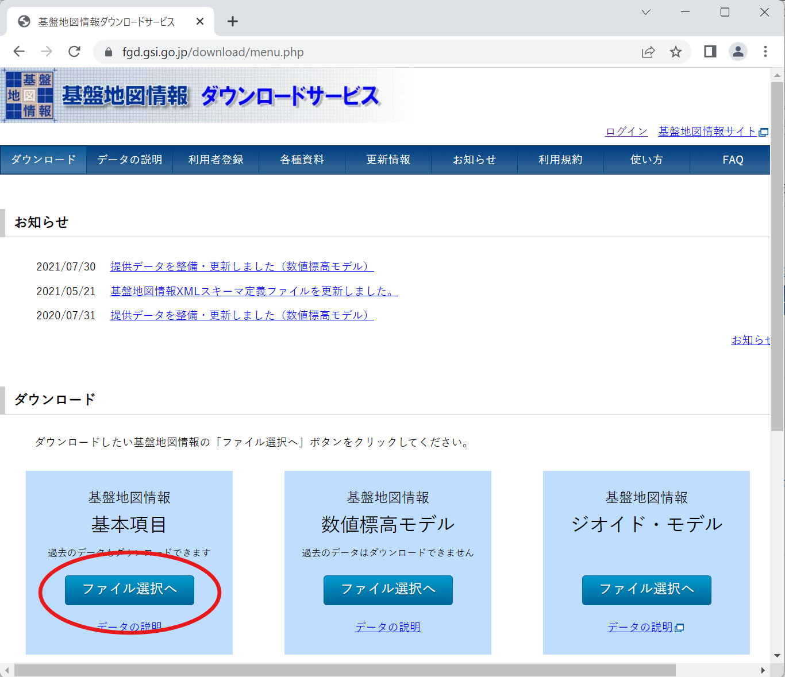

    次にダウンロードする地域を選択します。デモアプリでは静岡県沼津市の建物データしか登録していないため、「選択方法指定」で「都道府県または市区町村で選択」をチェックし、沼津市を選択してから「選択リストに追加」ボタンを押してください。

    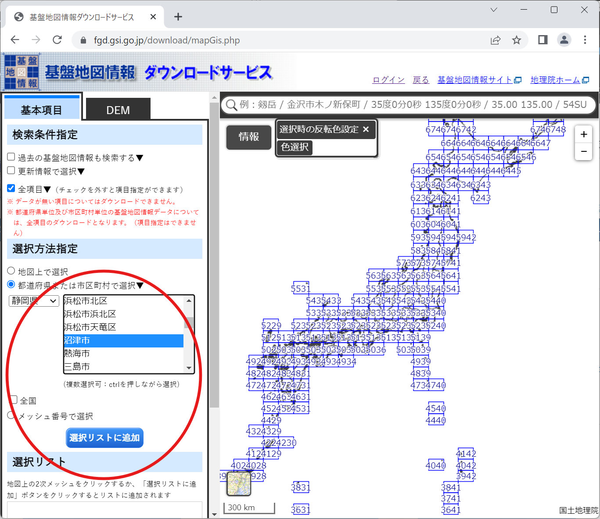

    選択リストから沼津市の中心部を含む「523856」を残して削除し、「ダウンロードファイル確認へ」ボタンを押します。

    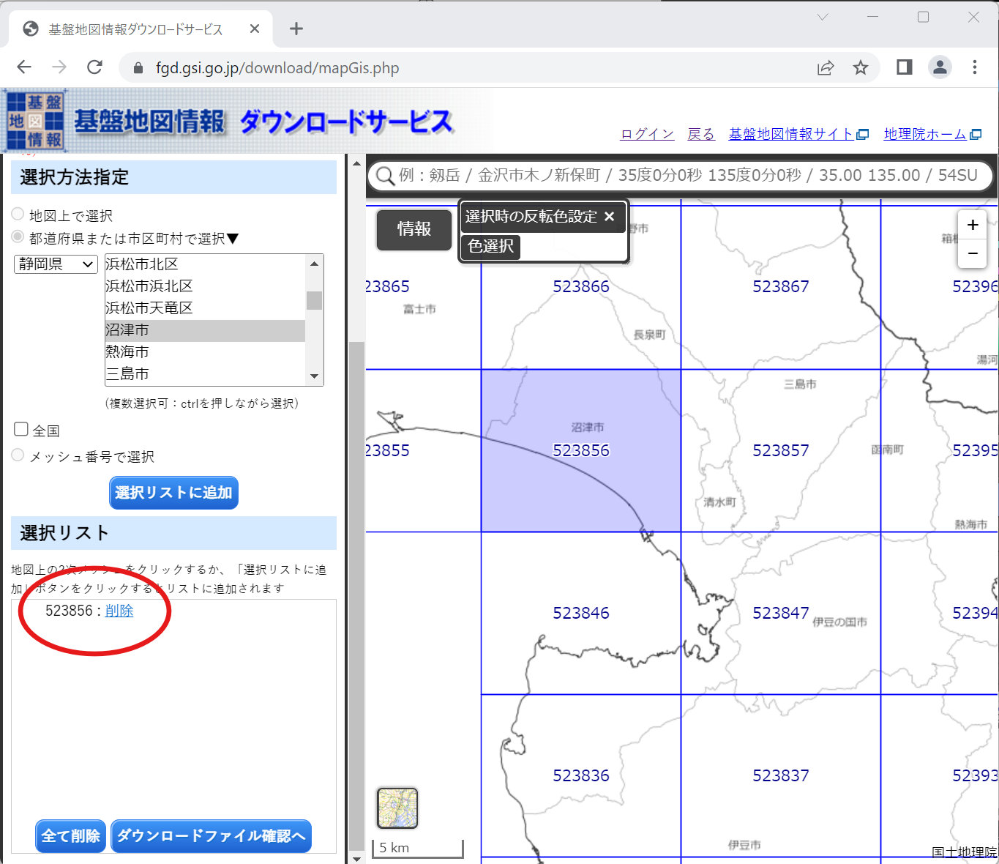

    ダウンロードファイルリストが表示されますので、「基盤地図情報 最新データ」と書かれているファイルの右側の「ダウンロード」ボタンを押してファイルを取得します。

    

    ログインIDとパスワードの入力画面が表示されるので、国土地理院の共通ログインIDとパスワードを入力し、ログインボタンを押します。まだIDを持っていない場合は「新規登録」リンクからアカウントを作成してください。

- ダウンロードしたファイルを展開

    ダウンロードしたファイル `FG-GML-523856-ALL-20221001.zip` を任意のフォルダに展開します。ファイルはレイヤごとに分かれているので、建物を含む `FG-GML-523856-BldA-20221001-0001.xml` ファイルのパスを覚えておいてください。

    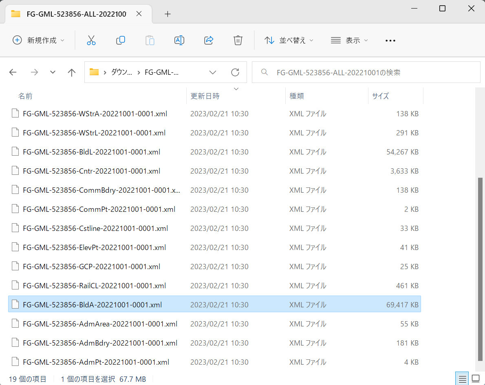

- QGIS にインポート

    QGIS を起動し、新しいプロジェクトを作ります。ここに先ほど展開した XML ファイルから建物データをインポートします。

    メインメニューから Layer > Add Layer > Add Vector Layer を選択します。

    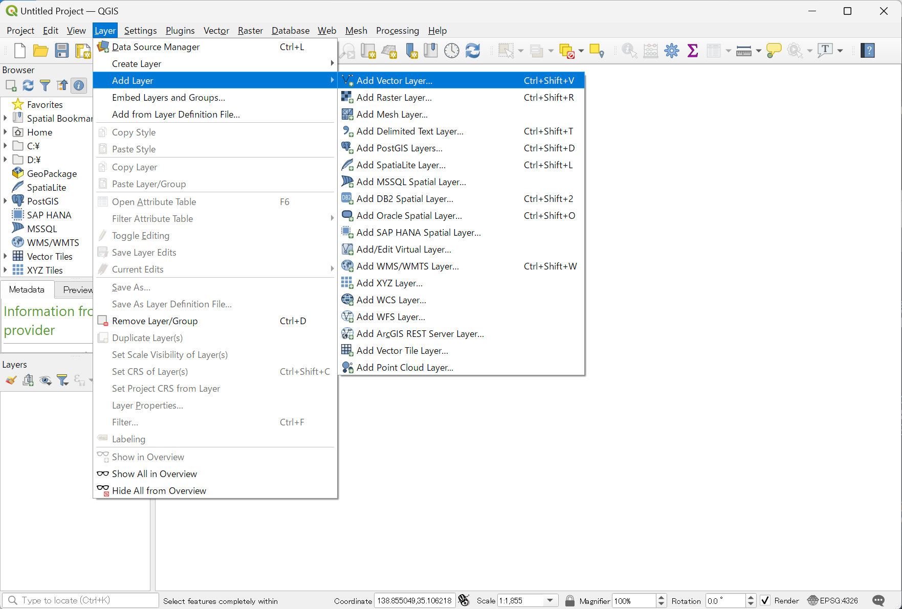

    Data Source Manager ダイアログが開くので、 Source の Vector Dataset(s) に XML ファイルのパスを入力します。右側のボタンを押すとファイル選択ダイアログが表示されるので、そちらから選択しても構いません。

    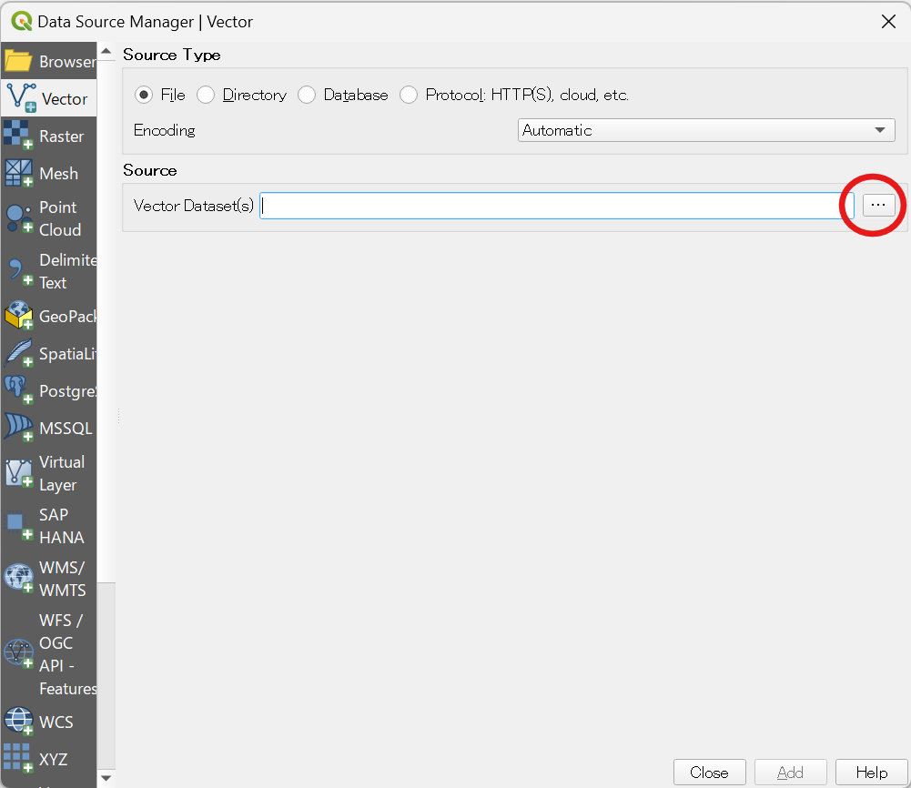

    ファイルを選択すると Options が表示されますが、ここは特に変更する必要がないので、そのまま右下の Add ボタンを押します。

    すると座標系変換の方法を選択するダイアログが表示されます。一番上に表示されているものが通常最も精度が高いので、そのまま OK ボタンを押します。

    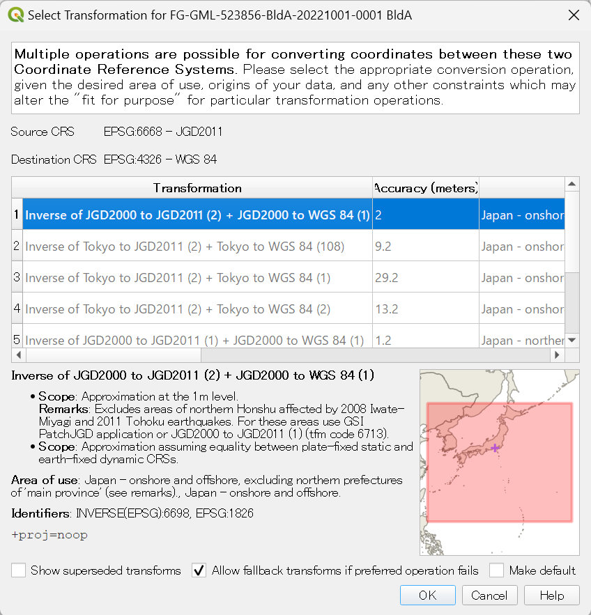

    インポートが完了すると、建物データが地図上に表示されます。少しつぶれているのは座標系として経緯度を単位とする EPSG:6668 (JGD2011) が選択されているためなので、問題ありません。

    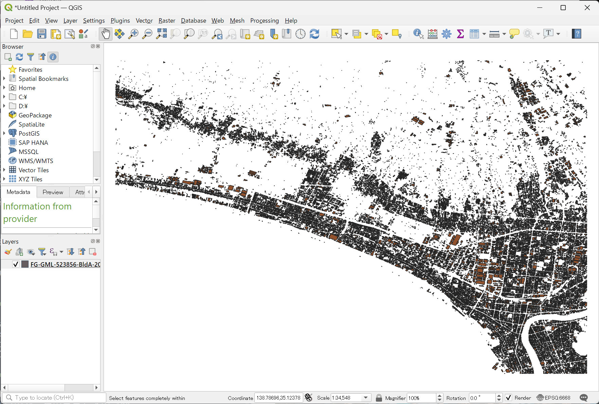

- GeoJSON データをファイルにエクスポート

    GeoJSON として保存したい建物を選択します（操作方法については [QGIS ドキュメント](https://docs.qgis.org/3.22/en/docs/user_manual/introduction/general_tools.html#selecting-manually-on-the-map-canvas) を参照してください）。

    選択した建物が黄色くマークされている状態で、 Layers パネルの FG-GML... レイヤを右クリックしてプルダウンメニューを開き、 Export > Save Selected Features As... をクリックします。

    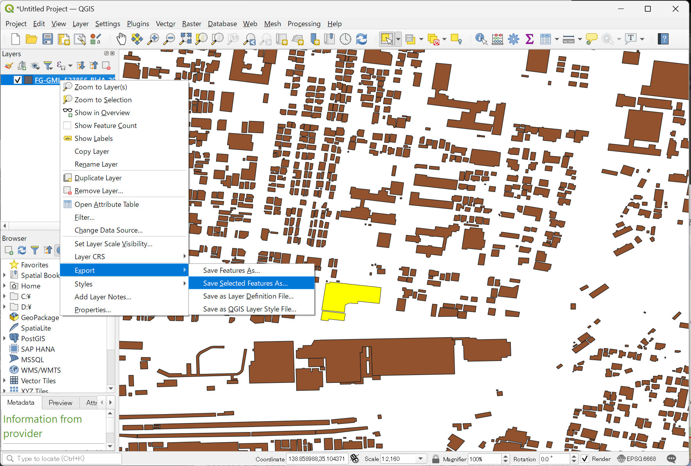

    Save Vector Layer as... ダイアログが表示されるので、 Format 欄を `GeoJSON`、 Geometry の Geometry type を `Polygon` に変更し、 File name に保存したいファイル名を指定して OK ボタンを押すと GeoJSON ファイルが保存されます。

    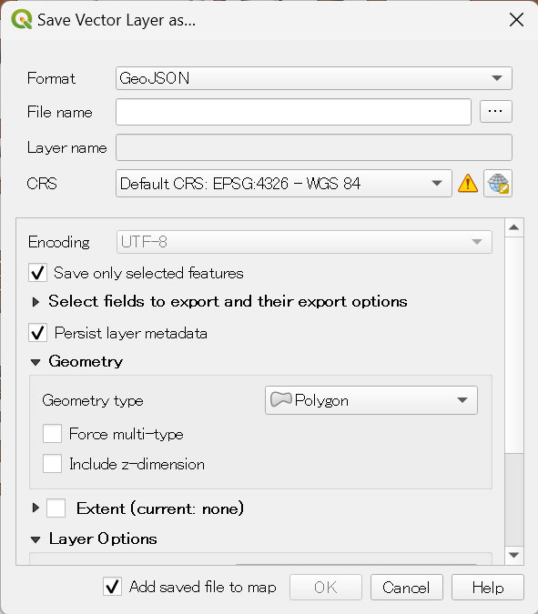

- GeoJSON データをクリップボードにコピー

    QGIS 上で選択したフィーチャーを Edit > Copy Features （または Ctrl+C）でクリップボードにコピーする際に、グローバルオプションを設定しておくと GeoJSON としてコピーできるようになります。

    メインメニューの Settings > Options を選択します。

    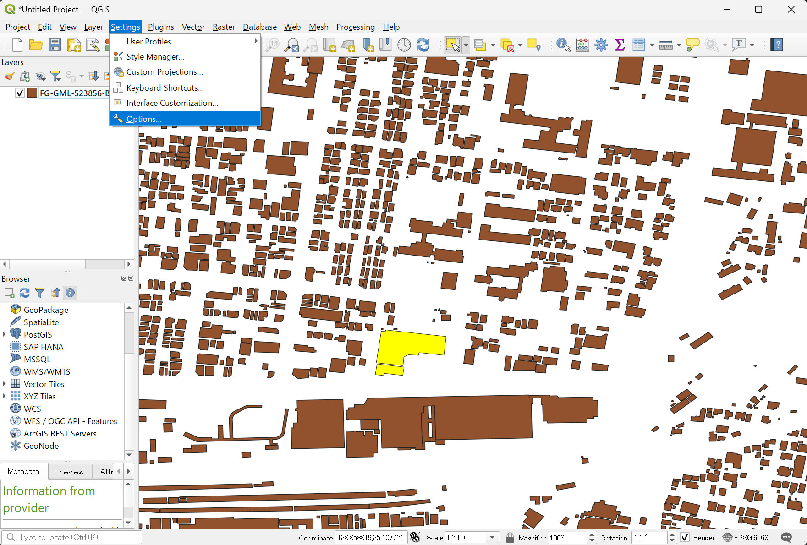

    Options ダイアログが表示されるので、左メニューで Data Sources を選択し、右側の Feature Attributes and Table ブロック内、 Copy features as のプルダウンで GeoJSON を選択します。

    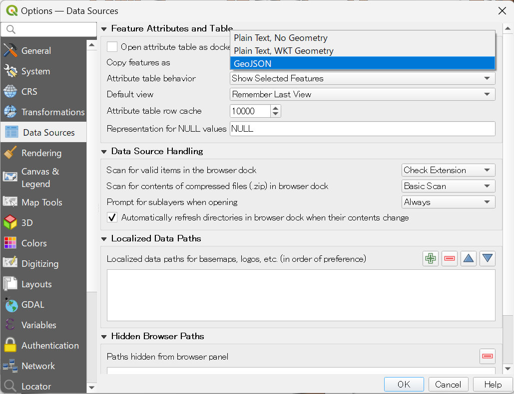

    あとは任意の建物フィーチャーを選択し、Ctrl+C でクリップボードにコピーすると GeoJSON になるので、テキストエディタやテキスト入力欄に貼り付けられます。

以上で 2D デモ検索用の GeoJSON 作成手順は終わりです。
