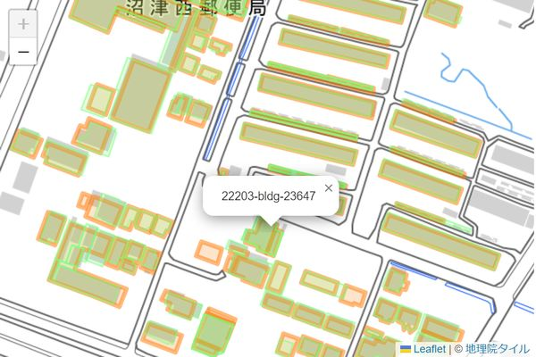

本ソフトウェアは、2D 地図データおよび 3D 点群データをPLATEAU 建物データと突合し、建物 ID との関連付けを行うWebAPI 機能を提供するサービスアプリケーションです。

以下の機能を提供します。

- [2D 建物マッチング機能](#2d): 2D 建物ポリゴンを PLATEAU 建物にマッチングします。
- [3D 点群マッチング機能](#3d_pointcloud): 3D 点群データを PLATEAU 建物にマッチングします。
- [3D テクスチャマッピング機能](#3d_texture): 3D 点群データを PLATEAU 建物のテクスチャとして
  マッピングします。

